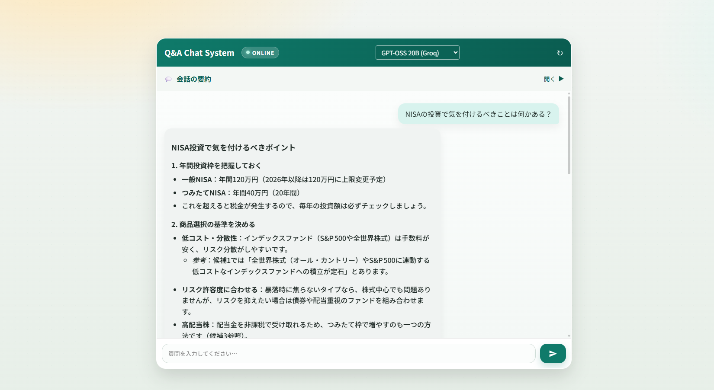

# Life-Style-Agent


## UI Preview

<p align="center">
  
</p>

Life-Style-Agent is an intelligent assistant with a RAG (Retrieval-Augmented Generation) engine for answering everyday life questions across domains like career, finance, cooking, home appliances, lifestyle, mental health, and society.

## Features

- **RAG (Retrieval-Augmented Generation):** Generates grounded answers using a FAISS vector database.
- **Multi-domain knowledge:** Covers careers, finance, cooking, home appliances, lifestyle, mental health, and society.
- **MCP (Model Context Protocol) support:** Runs as an MCP server for external agents/tools.
- **Web interface:** Simple chat UI for end users.
- **Conversation analysis:** Detects when support might be needed based on logs.
- **Multi-model support:** Gemini, OpenAI, Anthropic, Groq, and more.

## Tech Stack

- **Backend:** FastAPI (Python)
- **Vector DB:** FAISS
- **Embeddings:** HuggingFace (`intfloat/multilingual-e5-large`)
- **Frameworks:** LangChain, LlamaIndex
- **Frontend:** HTML/CSS/JS (Vanilla)
- **Infrastructure:** Docker, Docker Compose

## Directory Structure

```text
.
├── app.py                # FastAPI web app entrypoint
├── mcp_server.py         # MCP server implementation
├── lifestyle_agent/      # Core logic
│   ├── core/             # RAG engine (FAISS)
│   ├── api/              # MCP tool definitions
│   └── config/           # Paths, models, env config
├── data/                 # Data directory
│   ├── qa_jsonl/         # Source QA data
│   ├── vdb/faiss/        # Persisted FAISS indexes
│   └── home-topic/       # Raw documents (docx, etc.)
├── scripts/ingestion/    # Data ingestion & indexing scripts
├── web/                  # Web UI (templates & static files)
└── docs/                 # Docs & setup notes
```

## Quick Start (Docker Compose)

### 1) Prerequisites

- Docker
- Docker Compose (v2)

### 2) Configure secrets

Create `secrets.env` and set at least one API key.

```env
GOOGLE_API_KEY=your_api_key_here
# or
OPENAI_API_KEY=your_api_key_here
```

### 3) Start the app

```bash
docker compose up --build
```

Open `http://localhost:5000` in your browser.

### 4) (Optional) Build FAISS indexes

If you update the source corpus, rebuild the indexes inside the container:

```bash
docker compose run --rm qasystem python scripts/ingestion/jsonl_to_vector_faiss.py
```

### 5) Stop the app

```bash
docker compose down
```

## MCP Server Usage

The MCP server is available via `mcp_server.py` and exposes the `rag_answer` tool for MCP-compatible clients.

## Development Guidelines

See [AGENTS.md](AGENTS.md) for coding style, testing guidance, and operational notes.

---

<details>
<summary>日本語</summary>

# Life-Style-Agent

Life-Style-Agentは、家庭生活における多様なトピックに関する質問に答えるための、RAG（Retrieval-Augmented Generation）エンジンを備えた知的エージェントです。

## 特徴

- **RAG（Retrieval-Augmented Generation）:** FAISSベクトルデータベースを活用し、信頼性の高い回答を生成します。
- **マルチドメイン対応:** キャリア、金融、料理、家電、ライフスタイル、メンタルヘルス、社会などに対応。
- **MCP（Model Context Protocol）対応:** 他のエージェントやツールから呼び出し可能。
- **Webインターフェース:** 直感的なチャットUI。
- **会話分析:** 会話ログからサポートが必要なタイミングを検知。
- **マルチモデル対応:** Gemini、OpenAI、Anthropic、Groqなどに対応。

## 技術スタック

- **Backend:** FastAPI (Python)
- **Vector DB:** FAISS
- **Embeddings:** HuggingFace (`intfloat/multilingual-e5-large`)
- **Frameworks:** LangChain, LlamaIndex
- **Frontend:** HTML/CSS/JS (Vanilla)
- **Infrastructure:** Docker, Docker Compose

## ディレクトリ構成

```text
.
├── app.py                # FastAPI Webアプリケーションのエントリポイント
├── mcp_server.py         # MCPサーバーの実装
├── lifestyle_agent/      # コアロジック
│   ├── core/             # RAGエンジン (FAISS)
│   ├── api/              # MCPツール定義
│   └── config/           # パス、モデル、環境変数設定
├── data/                 # データディレクトリ
│   ├── qa_jsonl/         # ソースとなるQAデータ
│   ├── vdb/faiss/        # 永続化されたFAISSインデックス
│   └── home-topic/       # 生ドキュメント (docx等)
├── scripts/ingestion/    # データ加工・インデックス作成スクリプト
├── web/                  # Web UI (テンプレート・静的ファイル)
└── docs/                 # ドキュメント・セットアップノート
```

## クイックスタート（Docker Compose）

### 1) 前提

- Docker
- Docker Compose（v2）

### 2) secrets.env の設定

`secrets.env` を作成し、いずれかのAPIキーを設定してください。

```env
GOOGLE_API_KEY=your_api_key_here
# または
OPENAI_API_KEY=your_api_key_here
```

### 3) 起動

```bash
docker compose up --build
```

起動後、`http://localhost:5000` にアクセスしてください。

### 4) （任意）FAISSインデックスの再構築

ソースのコーパスを更新した場合は、コンテナ内で再構築します。

```bash
docker compose run --rm qasystem python scripts/ingestion/jsonl_to_vector_faiss.py
```

### 5) 停止

```bash
docker compose down
```

## MCPサーバー利用

`mcp_server.py` を通じて、MCP対応クライアントから `rag_answer` ツールを利用できます。

## 開発ガイドライン

詳細は [AGENTS.md](AGENTS.md) を参照してください。

</details>
