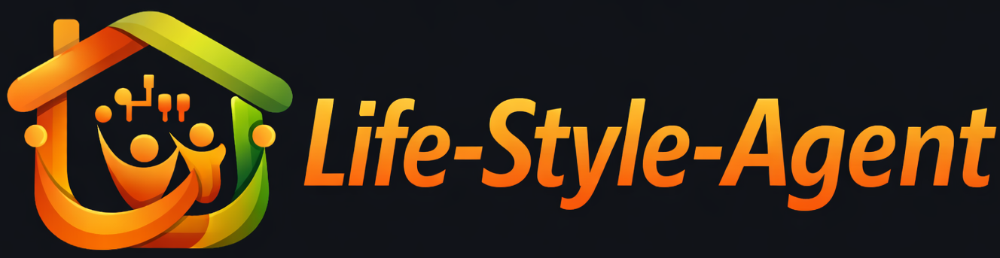

# Life-Style-Agent



Life-Style-Agentは、家庭生活における多様なトピックに関する質問に答えるための、RAG（Retrieval-Augmented Generation）エンジンを備えた知的エージェントです。

キャリア、金融、料理、家電、ライフスタイル、メンタルヘルス、社会などの専門知識を統合し、ユーザーの生活をサポートします。

## 🌟 特徴

- **RAG (Retrieval-Augmented Generation):** FAISSベクトルデータベースを活用し、信頼性の高いドキュメントに基づいた回答を生成します。
- **マルチドメイン対応:** 複数の専門分野（キャリア、施設、金融、料理、家電、ライフスタイル、メンタルヘルス、社会）に対応。
- **MCP (Model Context Protocol) 対応:** 他のエージェントやツールから呼び出し可能なMCPサーバーとしても機能します。
- **Webインターフェース:** 直感的なチャットUIを備えています。
- **会話分析:** 外部の会話ログを分析し、サポートが必要なタイミングを自動検知します。
- **マルチモデル対応:** Gemini, OpenAI, Anthropic, Groqなどの最新LLMを選択可能です。

## 🛠 技術スタック

- **Backend:** FastAPI (Python)
- **Vector DB:** FAISS
- **Embeddings:** HuggingFace (`intfloat/multilingual-e5-large`)
- **Frameworks:** LangChain, LlamaIndex
- **Frontend:** HTML/CSS/JS (Vanilla)
- **Infrastructure:** Docker, Docker Compose

## 📁 ディレクトリ構造

```text
.
├── app.py                # FastAPI Webアプリケーションのエントリポイント
├── mcp_server.py         # MCPサーバーの実装
├── lifestyle_agent/      # コアロジック
│   ├── core/             # RAGエンジン (FAISS)
│   ├── api/              # MCPツール定義
│   └── config/           # パス、モデル、環境変数設定
├── data/                 # データディレクトリ
│   ├── qa_jsonl/         # ソースとなるQAデータ
│   ├── vdb/faiss/        # 永続化されたFAISSインデックス
│   └── home-topic/       # 生ドキュメント (docx等)
├── scripts/ingestion/    # データ加工・インデックス作成スクリプト
├── web/                  # Web UI (テンプレート・静的ファイル)
└── docs/                 # ドキュメント・セットアップノート
```

## 🚀 セットアップ

### 1. 環境構築

Python 3.12 以上、および [uv](https://docs.astral.sh/uv/) が必要です。

```bash
# 依存関係のインストール（仮想環境も自動作成されます）
uv sync
```

### 2. 環境変数の設定

`secrets.env` ファイルを作成し、必要なAPIキーを設定してください。

```env
GOOGLE_API_KEY=your_api_key_here
# または
OPENAI_API_KEY=your_api_key_here
```

### 3. ベクトルデータベースの構築

ドキュメントからFAISSインデックスを作成します。

```bash
# JSONLからFAISSを作成
python scripts/ingestion/jsonl_to_vector_faiss.py
```

## 💻 使い方

### Webチャットアプリの起動

```bash
python app.py
```
起動後、ブラウザで `http://localhost:5000` にアクセスしてください。

### MCPサーバーとしての利用

`mcp_server.py` を通じて、MCP対応クライアント（Clineなど）から以下のツールを利用できます。

- `rag_answer`: 生活に関する質問に回答。

### Dockerでの実行

```bash
docker compose up --build
```

## 📝 開発ガイドライン

詳細は [AGENTS.md](AGENTS.md) を参照してください。
- **コーディングスタイル:** PEP 8準拠
- **コミットメッセージ:** 簡潔で意図が明確なメッセージ（日本語/英語）
