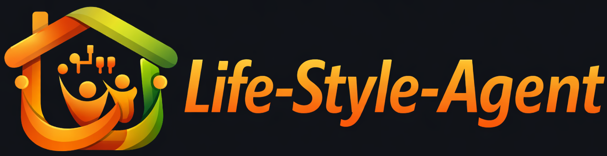
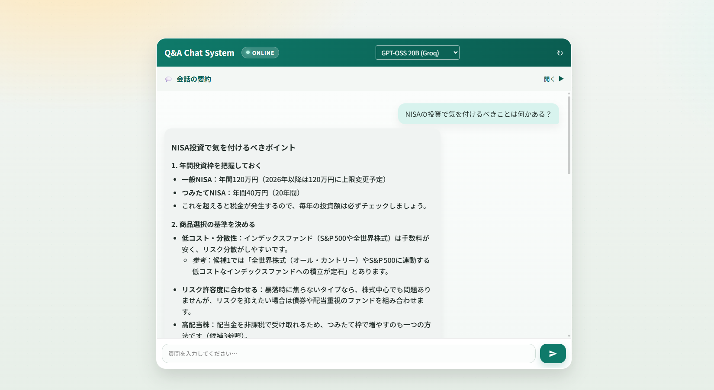

> 一番下に日本語版もあります。

# Life-Style-Agent




## UI Preview

<p align="center">
  
</p>

## 🎬 Demo Videos

Click a thumbnail to open the video on YouTube.

| [](https://youtu.be/Ekhm9XJBhUg) | [](https://youtu.be/Qoidfk93CHk) |
| --- | --- |
| Looking up tonight's dinner menu | What to watch out for in NISA (stock) investing |

Life-Style-Agent is an intelligent assistant with a RAG (Retrieval-Augmented Generation) engine for answering everyday life questions across domains like career, finance, cooking, home appliances, lifestyle, mental health, and society.

## Features

- **RAG (Retrieval-Augmented Generation):** Generates grounded answers using a FAISS vector database.
- **Multi-domain knowledge:** Covers careers, finance, cooking, home appliances, lifestyle, mental health, and society.
- **MCP (Model Context Protocol) support:** Runs as an MCP server for external agents/tools.
- **Web interface:** Simple chat UI for end users.
- **Conversation analysis:** Detects when support might be needed based on logs.
- **Multi-model support:** Gemini, OpenAI, Anthropic, Groq, and more.

## Tech Stack

- **Backend:** FastAPI (Python)
- **Vector DB:** FAISS
- **Embeddings:** HuggingFace (`intfloat/multilingual-e5-large`)
- **Frameworks:** LangChain, LlamaIndex
- **Frontend:** HTML/CSS/JS (Vanilla)
- **Infrastructure:** Docker, Docker Compose

## Directory Structure

```text
.
├── app.py                # FastAPI web app entrypoint
├── mcp_server.py         # MCP server implementation
├── lifestyle_agent/      # Core logic
│   ├── core/             # RAG engine (FAISS)
│   ├── api/              # MCP tool definitions
│   └── config/           # Paths, models, env config
├── data/                 # Data directory
│   ├── qa_jsonl/         # Source QA data
│   ├── vdb/faiss/        # Persisted FAISS indexes
│   └── home-topic/       # Raw documents (docx, etc.)
├── scripts/ingestion/    # Data ingestion & indexing scripts
├── web/                  # Web UI (templates & static files)
└── docs/                 # Docs & setup notes
```

## Quick Start (Docker Compose)

### 1) Prerequisites

- Docker
- Docker Compose (v2)

### 2) Configure secrets

Create `secrets.env` and set at least one API key.

```env
GOOGLE_API_KEY=your_api_key_here
# or
OPENAI_API_KEY=your_api_key_here
```

### 3) Start the app

```bash
docker compose up --build
```

Open `http://localhost:5000` in your browser.

### 4) (Optional) Build FAISS indexes

If you update the source corpus, rebuild the indexes inside the container:

```bash
docker compose run --rm qasystem python scripts/ingestion/jsonl_to_vector_faiss.py
```

### 5) Stop the app

```bash
docker compose down
```

## MCP Server Usage

The MCP server is available via `mcp_server.py` and exposes the `rag_answer` tool for MCP-compatible clients.

## Evaluation

### Life-Style Agent

**Overview**

10 QA tasks across 4 domains were evaluated against 9 LLMs. Scoring is based on whether the model's answer contains the core keywords from the expected answer.

| Score | Criteria |
|---|---|
| ○ | All core keywords present |
| △ | At least one core keyword present |
| × | No core keywords present |

**Tasks**

| # | Domain | Question (Summary) | Expected Answer |
|---|---|---|---|
| 1 | Home | What to do immediately after ironing to prevent re-wrinkling? | Hang and let cool |
| 2 | Cooking | How to check avocado ripeness beyond skin color? | Gently press (slight give) or check stem detachment |
| 3 | Finance | Annual investment limit for the "tsumitate" frame in new NISA? | ¥1,200,000/year (¥100,000/month) |
| 4 | Mental | How many seconds does the peak of anger last? | 6 seconds |
| 5 | Cooking | How to prep chicken breast to keep it moist? | Slice thin; marinate with shio-koji or mayo for 10 min; or coat with starch and cook on low heat |
| 6 | Mental | How does the 4-7-8 breathing technique work? | Inhale 4 sec → hold 7 sec → exhale 8 sec |
| 7 | Cooking | Too tired to use a knife — easy dish with pork belly and napa cabbage? | Layered pork & cabbage steam: stack in pot, add sake & chicken stock, leave to steam |
| 8 | Cooking | Meal-prep ideas that work in lunch boxes and can be frozen? | Chicken nanban, hijiki & soybean simmered dish, infinite pepper & miso pork stir-fry, etc. |
| 9 | Finance | iDeCo vs NISA — what's the unique benefit of iDeCo and its key restriction? | Benefit: full income deduction. Restriction: cannot withdraw until age 60 |
| 10 | Mental | Big presentation tomorrow, too anxious to sleep — what to do? | Try military sleep method (progressive muscle relaxation); if still awake, accept that lying still rests the body ~80% |

**Results**

| Task | GPT-4.1 | Gemini 2.5 Pro | Claude Opus 4.5 | Claude Haiku 4.5 | Llama 3.3 70B | Qwen 3 32B | Gemini 2.5 Flash-Lite | Llama 3.1 8B | GPT-o4-mini |
|---|---|---|---|---|---|---|---|---|---|
| 1 | ○ | ○ | ○ | ○ | ○ | ○ | ○ | ○ | ○ |
| 2 | ○ | ○ | ○ | ○ | ○ | ○ | ○ | ○ | ○ |
| 3 | ○ | ○ | ○ | ○ | ○ | ○ | ○ | ○ | ○ |
| 4 | ○ | ○ | ○ | ○ | ○ | ○ | ○ | ○ | ○ |
| 5 | ○ | ○ | ○ | ○ | ○ | **△** | ○ | ○ | ○ |
| 6 | ○ | ○ | ○ | ○ | ○ | ○ | ○ | ○ | ○ |
| 7 | ○ | ○ | ○ | ○ | ○ | ○ | ○ | ○ | ○ |
| 8 | ○ | ○ | ○ | ○ | ○ | ○ | ○ | ○ | ○ |
| 9 | ○ | ○ | ○ | ○ | ○ | ○ | ○ | ○ | ○ |
| 10 | ○ | ○ | ○ | ○ | ○ | ○ | ○ | ○ | ○ |

**Analysis**

All models scored ○ except Qwen 3 32B on task 5 (△). The single gap is likely a keyword-matching artifact rather than a true capability gap — Qwen's answer was semantically correct but phrased differently.

More importantly, **all models received the same retrieved context** because the same embedding model (`intfloat/multilingual-e5-large`) was used throughout. This means **retrieval quality dominated the results**, not LLM generation ability. Future evaluations will introduce synonym-aware and semantic-similarity metrics to reduce surface-form bias.

## Development Guidelines

See [AGENTS.md](AGENTS.md) for coding style, testing guidance, and operational notes.

---

<details>
<summary>日本語</summary>

# Life-Style-Agent


## UIプレビュー

<p align="center">
  
</p>

## 🎬 デモ動画

サムネイルをクリックすると、YouTubeで動画を開けます。

| [](https://youtu.be/Ekhm9XJBhUg) | [](https://youtu.be/Qoidfk93CHk) |
| --- | --- |
| 今日の晩御飯の献立を調べる | NISA(株式）投資で気を付けることを調べる |

Life-Style-Agentは、家庭生活における多様なトピックに関する質問に答えるための、RAG（Retrieval-Augmented Generation）エンジンを備えた知的エージェントです。

## 特徴

- **RAG（Retrieval-Augmented Generation）:** FAISSベクトルデータベースを活用し、信頼性の高い回答を生成します。
- **マルチドメイン対応:** キャリア、金融、料理、家電、ライフスタイル、メンタルヘルス、社会などに対応。
- **MCP（Model Context Protocol）対応:** 他のエージェントやツールから呼び出し可能。
- **Webインターフェース:** 直感的なチャットUI。
- **会話分析:** 会話ログからサポートが必要なタイミングを検知。
- **マルチモデル対応:** Gemini、OpenAI、Anthropic、Groqなどに対応。

## 技術スタック

- **Backend:** FastAPI (Python)
- **Vector DB:** FAISS
- **Embeddings:** HuggingFace (`intfloat/multilingual-e5-large`)
- **Frameworks:** LangChain, LlamaIndex
- **Frontend:** HTML/CSS/JS (Vanilla)
- **Infrastructure:** Docker, Docker Compose

## ディレクトリ構成

```text
.
├── app.py                # FastAPI Webアプリケーションのエントリポイント
├── mcp_server.py         # MCPサーバーの実装
├── lifestyle_agent/      # コアロジック
│   ├── core/             # RAGエンジン (FAISS)
│   ├── api/              # MCPツール定義
│   └── config/           # パス、モデル、環境変数設定
├── data/                 # データディレクトリ
│   ├── qa_jsonl/         # ソースとなるQAデータ
│   ├── vdb/faiss/        # 永続化されたFAISSインデックス
│   └── home-topic/       # 生ドキュメント (docx等)
├── scripts/ingestion/    # データ加工・インデックス作成スクリプト
├── web/                  # Web UI (テンプレート・静的ファイル)
└── docs/                 # ドキュメント・セットアップノート
```

## クイックスタート（Docker Compose）

### 1) 前提

- Docker
- Docker Compose（v2）

### 2) secrets.env の設定

`secrets.env` を作成し、いずれかのAPIキーを設定してください。

```env
GOOGLE_API_KEY=your_api_key_here
# または
OPENAI_API_KEY=your_api_key_here
```

### 3) 起動

```bash
docker compose up --build
```

起動後、`http://localhost:5000` にアクセスしてください。

### 4) （任意）FAISSインデックスの再構築

ソースのコーパスを更新した場合は、コンテナ内で再構築します。

```bash
docker compose run --rm qasystem python scripts/ingestion/jsonl_to_vector_faiss.py
```

### 5) 停止

```bash
docker compose down
```

## MCPサーバー利用

`mcp_server.py` を通じて、MCP対応クライアントから `rag_answer` ツールを利用できます。

## 評価

### ライフスタイルエージェント

**概要**

4つのドメインにわたる10のQAタスクを、9つのLLMで評価しました。採点基準は、モデルの回答に正解の核となるキーワードが含まれているかどうかです。

| 評価 | 基準 |
|---|---|
| ○ | 核となる単語をすべて含む |
| △ | 1つ以上核となる単語を含む |
| × | 1つも含まない |

**評価タスク一覧**

| # | ドメイン | 質問（要約） | 正解 |
|---|---|---|---|
| 1 | 家電 | アイロン後、戻りジワを防ぐためにすぐすべきことは？ | ハンガーで冷ます |
| 2 | 料理 | アボカドの食べ頃を皮の色以外で見分けるには？ | 指で押して弾力を確認、またはヘタが取れそうか確認 |
| 3 | 金融 | 新NISAの「つみたて投資枠」の年間上限額は？ | 年間120万円（月10万円） |
| 4 | メンタル | 怒りの感情のピークは何秒続く？ | 6秒 |
| 5 | 料理 | 鶏胸肉をパサつかせずしっとり仕上げる下処理は？ | 削ぎ切り・塩麹かマヨで10分漬け・片栗粉をまぶして弱火 |
| 6 | メンタル | 「4-7-8呼吸法」の具体的なやり方は？ | 4秒吸って→7秒止めて→8秒吐く |
| 7 | 料理 | 疲れて包丁を使いたくない。豚バラと白菜で作れる簡単な料理は？ | 豚バラと白菜の重ね蒸し（酒と鶏ガラスープを入れて放置） |
| 8 | 料理 | 弁当に入れられて冷凍保存もできる作り置きおかずは？ | 鶏むね南蛮漬け、ひじきと大豆の煮物、無限ピーマンの肉味噌炒めなど |
| 9 | 金融 | iDeCo特有のメリットと「引き出し制限」は？ | メリット：掛金が全額所得控除。制限：原則60歳まで引き出せない |
| 10 | メンタル | 明日プレゼンがあって緊張で眠れない。どうすればいい？ | 米軍式睡眠法（筋弛緩）を試す。それでも無理なら「横になるだけで8割休める」と割り切る |

**評価結果**

| タスク | GPT-4.1 | Gemini 2.5 Pro | Claude Opus 4.5 | Claude Haiku 4.5 | Llama 3.3 70B | Qwen 3 32B | Gemini 2.5 Flash-Lite | Llama 3.1 8B | GPT-o4-mini |
|---|---|---|---|---|---|---|---|---|---|
| 1 | ○ | ○ | ○ | ○ | ○ | ○ | ○ | ○ | ○ |
| 2 | ○ | ○ | ○ | ○ | ○ | ○ | ○ | ○ | ○ |
| 3 | ○ | ○ | ○ | ○ | ○ | ○ | ○ | ○ | ○ |
| 4 | ○ | ○ | ○ | ○ | ○ | ○ | ○ | ○ | ○ |
| 5 | ○ | ○ | ○ | ○ | ○ | **△** | ○ | ○ | ○ |
| 6 | ○ | ○ | ○ | ○ | ○ | ○ | ○ | ○ | ○ |
| 7 | ○ | ○ | ○ | ○ | ○ | ○ | ○ | ○ | ○ |
| 8 | ○ | ○ | ○ | ○ | ○ | ○ | ○ | ○ | ○ |
| 9 | ○ | ○ | ○ | ○ | ○ | ○ | ○ | ○ | ○ |
| 10 | ○ | ○ | ○ | ○ | ○ | ○ | ○ | ○ | ○ |

**考察**

Qwen 3 32Bのタスク5における△を除き、全モデルが○を記録しました。この差分はモデル能力の差というより、**表層一致ベースの採点（言い換え耐性の欠如）** が影響した可能性があります。

より重要な点として、全評価タスクで同一の埋め込みモデル（`intfloat/multilingual-e5-large`）を使用したため、**すべてのLLMに渡される検索コンテキストは同一**でした。その結果、**モデル間の回答精度に大きな差は生じず、結果を支配したのはLLMの生成能力ではなく検索フェーズ（埋め込みモデル）の質**であることが示されました。今後は同義語許容・意味類似度に基づく補助評価を導入する予定です。

## 開発ガイドライン

詳細は [AGENTS.md](AGENTS.md) を参照してください。

</details>
